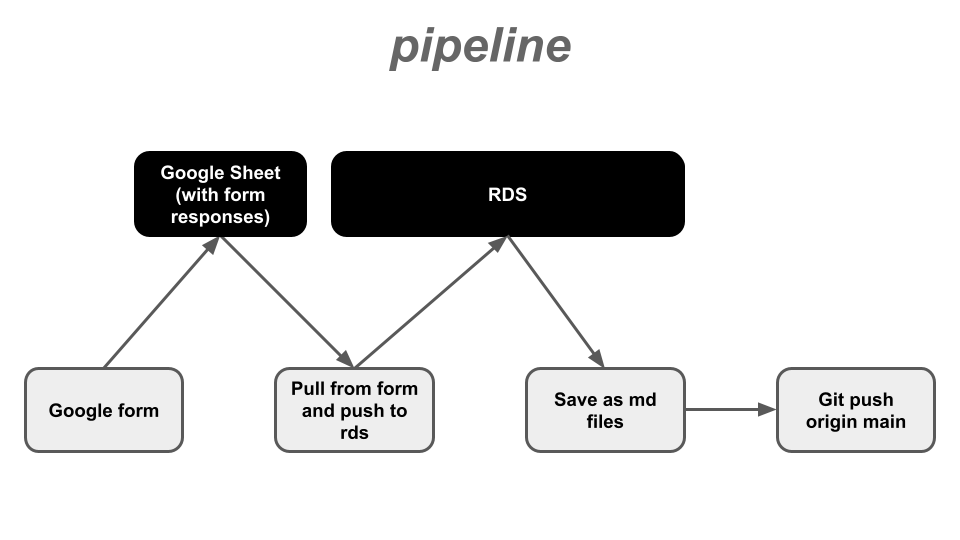

# ToDo

- [ ] tabular post view
- [ ] modify search bar to handle tabular view
- [ ] sort by date

# Pipeline

1. Hired writer submits summary to google form; auto saved to a google sheet
2. A script in `operations/library/` pulls from the google sheet and pushes to our RDS
3. Another script in `operations/library/` pulls from the RDS and generates local markdown files formatted in the way the Chirpy theme and Jekyll are expecting.
4. This repo is deployed as a github pages site, which is embedded in an iframe on our wordpress website.

---

# Source

This repo is a fork of the [Chirpy Theme](https://img.shields.io/gem/v/jekyll-theme-chirpy) by [cotes2020](https://img.shields.io/github/license/cotes2020/chirpy-starter.svg?color=blue)

---

# Notes

Build with warning boxes:

> **Did the study rely on proxy variables to measure polarization?**: 
> 
> {Polarization Proxies}
{{: .prompt-tip }}

> **Were standard p-value thresholds used (p<.05 or 95% Confidence Intervals that don’t overlap zero)?**: 
>
> {Inference Metrics}
{{: .prompt-danger }}

> **Were correlational results interpreted with causal language?**: 
>
> {Causal Claims from Correlational Data}
{{: .prompt-danger }}